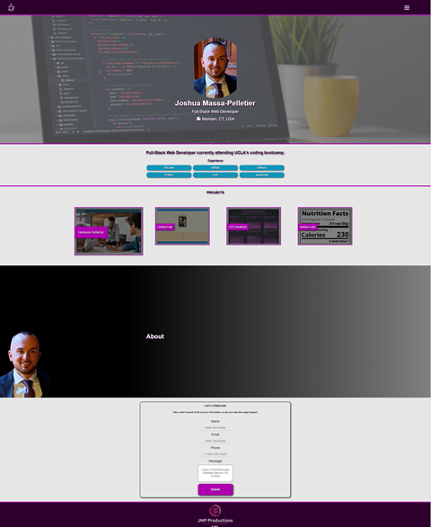
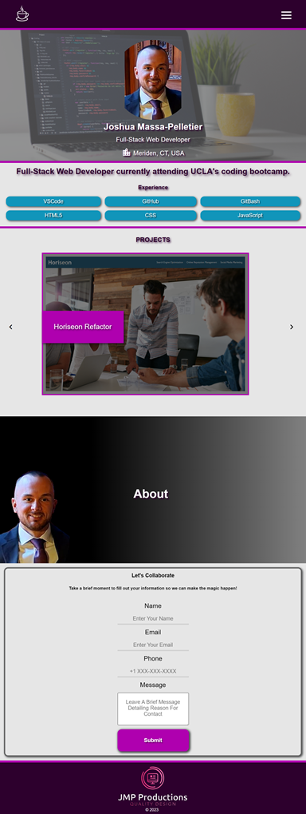
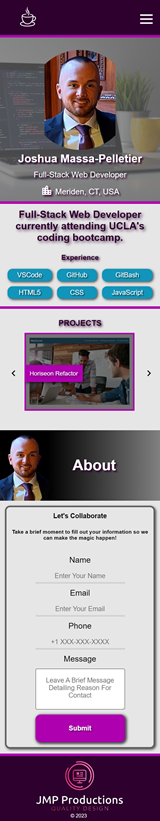

# Portfolio - Joshua Massa-Pelletier

## Overview
I created this portfolio as a way to showcase my experience, projects, and skills. My portfolio provides potential employers, collaborators, and clients a visually appealing and interactive way to explore my work and learn more about me.

## Features

1. Responsive Design

   * I designed my webpage to be fully responsive from the smallest mobile devices, to tablets, to the largest desktops to provide a consistent means to view my portfolio in an enjoyable and engaging experience.

2. Navigation Menu

    * At the top right of the page, you will find a hamburger style navigation menu that will take you directly to the specified sections of my portfolio, as well as links to both my GitHub and LinkedIn profiles to obtain a better understanding of my professional journey.

3. Showcase of Recent Projects

    * In this portfolio, I have included a showcase of my most recent projects for potential employers, collaborators, and clients to be able to gauge the scope of my work. This includes a titled image of the project that, when clicked on, will take you to the deployed project's webpage.

4. Experience

    * I have included a section listing the technologies that I currently specialize in, with more to come as I progress in my career as a Web Developer. This section helps provide a way to quickly identify my areas of expertise.

5. About Me

    * This contains a brief description of my history to allow visitors a glimpse into my professional career and what drives me to do what I do.

6. Contact Information

    * I have provided a contact form at the bottom of the page as an easy way for potential employers, collaborators, and clients to reach out with any and all questions.

7. Technologies Used

    * HTML5
    * CSS
    * JavaScript
    * VSCode
    * GitBash

## Usage
To view this webpage, please visit https://joshmassa.github.io/portfolio/

To view this projects repository, please visit https://github.com/JoshMassa/portfolio

When viewed from a desktop, the webpage should resemble the following image:

When viewed from a tablet, the webpage should resemble the following image:

When viewed from a mobile device, the webpage should resemble the following image:

## Credits

This project brought to you in part by UCLA Extension and it's staff including but not limited to: Our class instructor and teaching assistant of UCLA Extension Coding Bootcamp 2023-2024.

Links to resource references used as follows:

Custom Nav Bar: https://www.youtube.com/watch?v=yFWAOzwovrQ

Icons: https://materializecss.com/icons.html

Project Section Horizontal Scroll: https://www.youtube.com/watch?v=gzXyRa7jwk4

## License
This project does not contain a license.